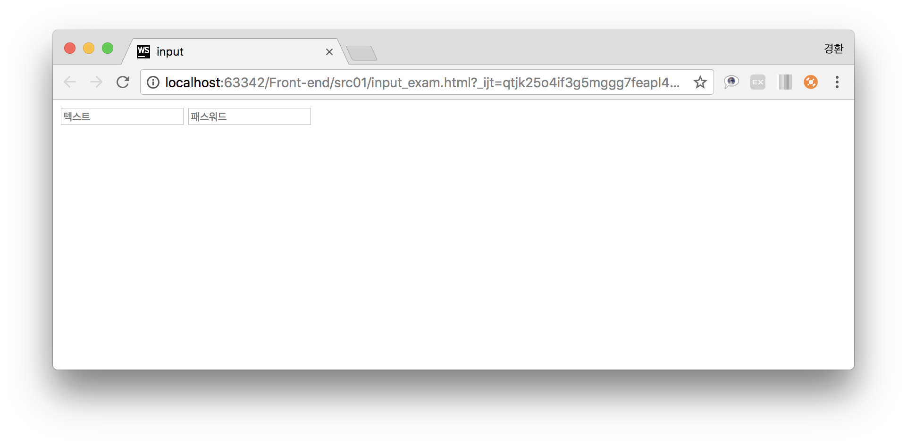
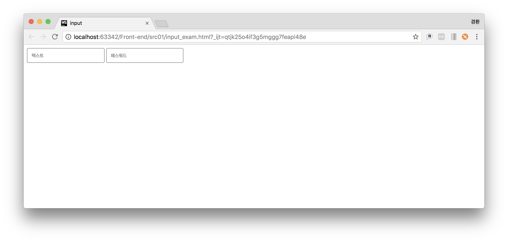
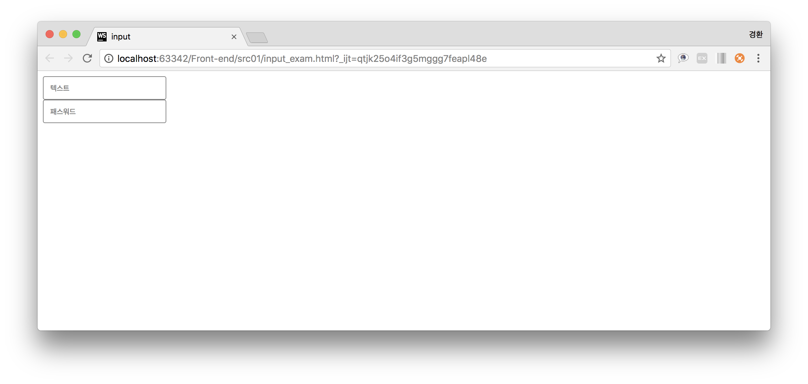
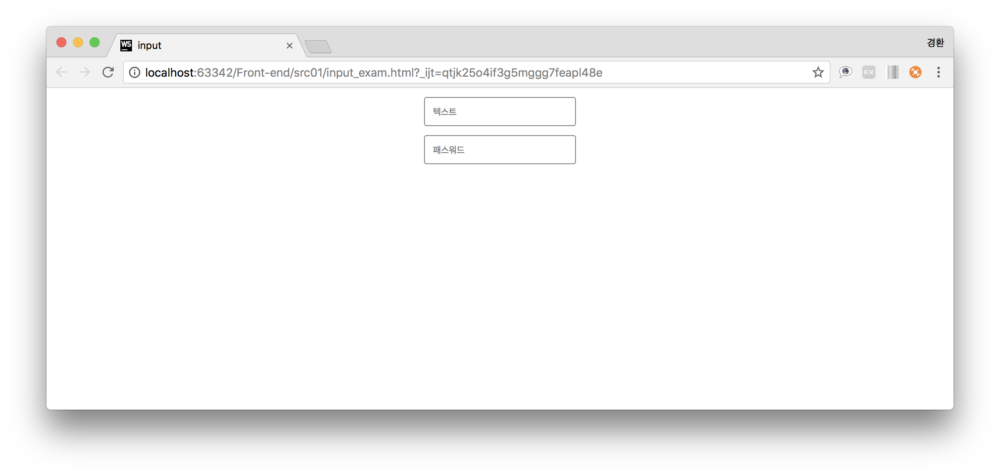
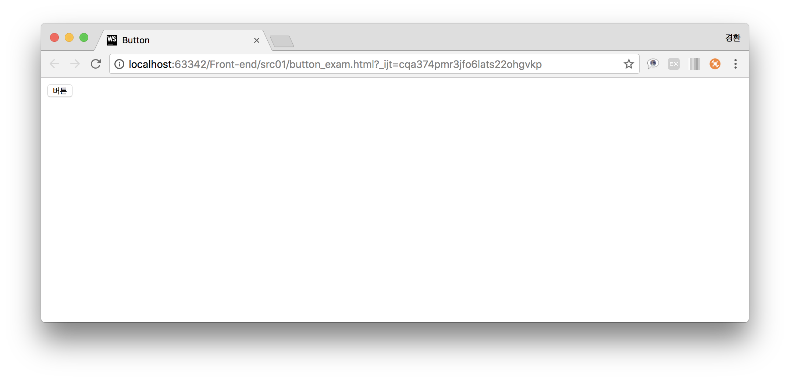
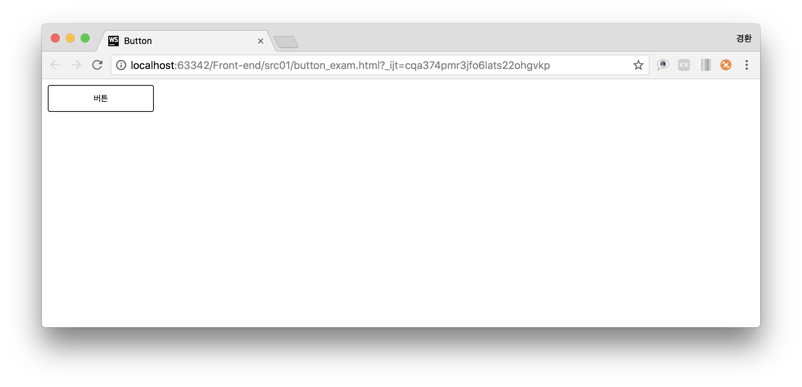
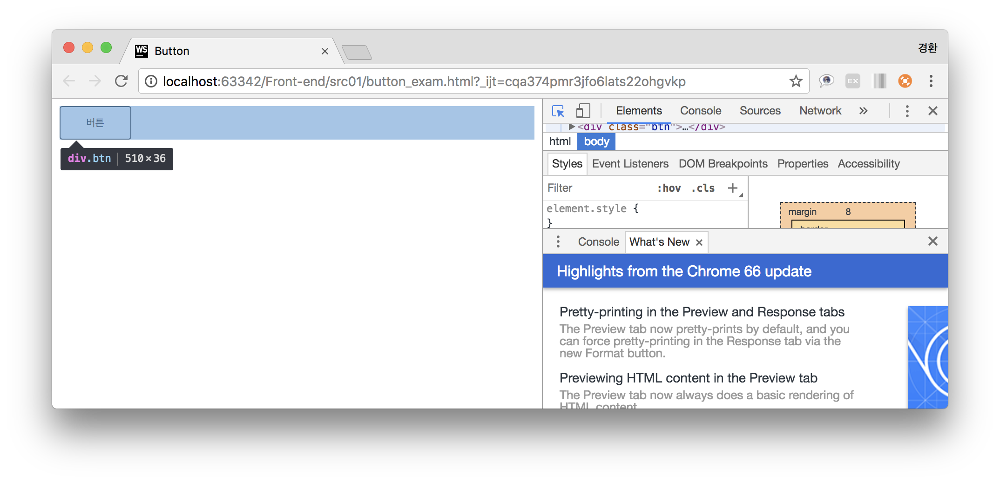
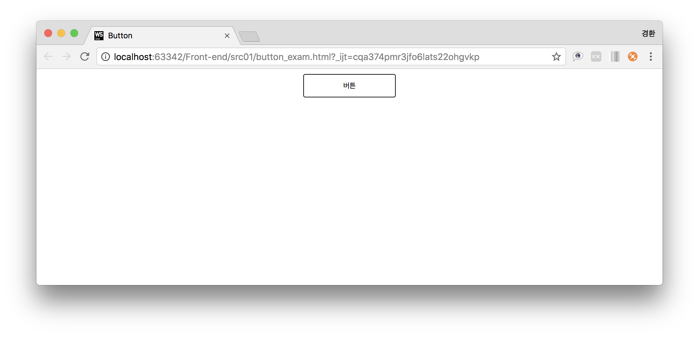

## Center alignment ##
input 태그와 button 태그 화면 중앙정렬

### 1) Input
1. input 태그 생성
~~~
<input type="text" placeholder="텍스트">
<input type="password" placeholder="패스워드">
~~~

2. 크기 및 모양조절
~~~
border: 1px solid gray;
border-radius: 3px;
padding: 10px;
width: 15%;
~~~

3. 디스플레이 지정
~~~
display: block;
~~~

4. 중앙정렬
~~~
margin: 1% auto;
~~~

### 2) Button
1. Button 태그 생성
~~~
<button type="submit">버튼</button>
~~~

2. 크기 및 모양조절
~~~
border: 1px solid black;
border-radius: 3px;
padding: 10px;
width: 15%;
~~~

3. 태그 감싸기
~~~

    <button type="submit">버튼</button>

~~~

4. 중앙정렬
~~~
text-align: center;
~~~

