## Change Radio_Button ##
라디오 버튼 사각형 버튼으로 변경하기

### Resoultion
1. radio button 생성
~~~
<input type="radio" name="exam">
<input type="radio" name="exam">
~~~

2. label 태그로 버튼 감싸기
~~~
<label>
    <input type="radio" name="exam">
    선택1
</label>

<label>
    <input type="radio" name="exam">
    선택2
</label>
~~~
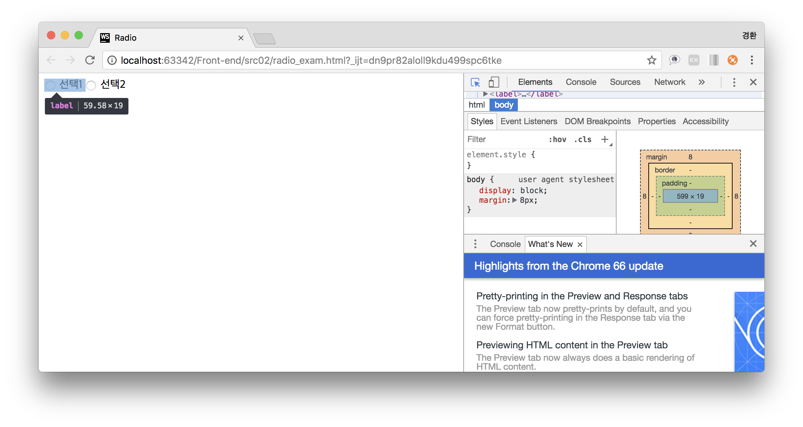
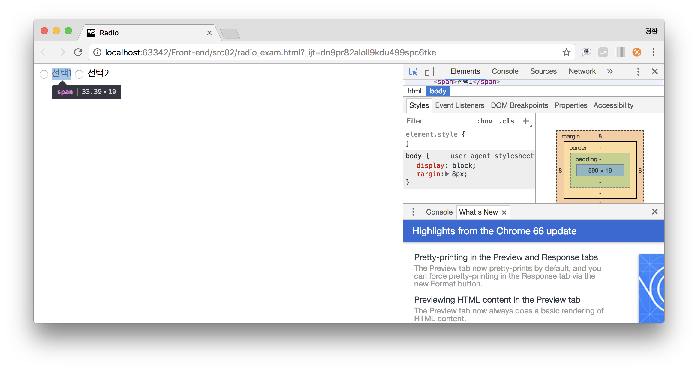

3. 사각형 영역 생성을 위한 span 태그 감싸기
~~~
<label>
    <input type="radio" name="exam">
    

        선택1
    

</label>

<label>
    <input type="radio" name="exam">
    

        선택2
    

</label>
~~~
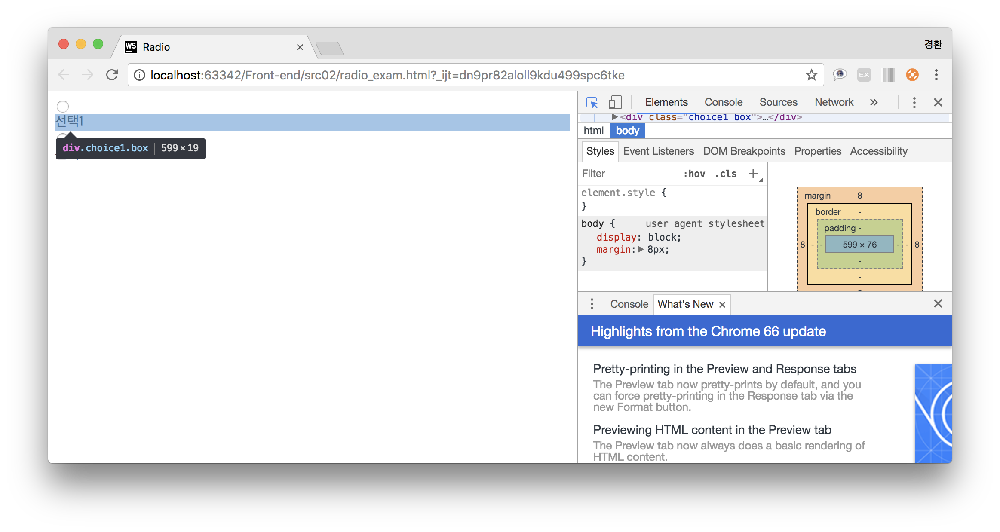
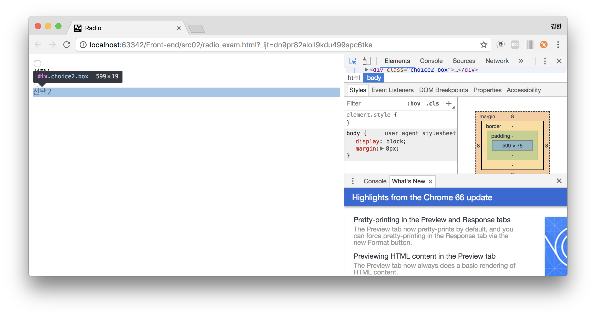

4. 기본 라디오 버튼모양 제거
~~~
input[type="radio"]{
    display: none;
}
~~~
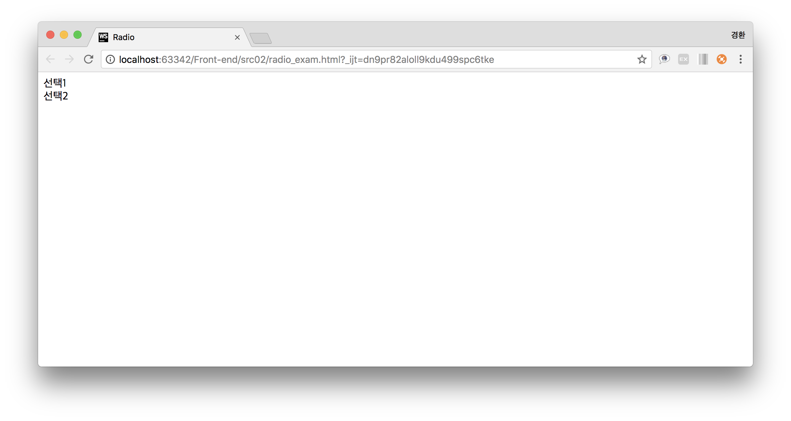

5. 사각형 꾸미기
~~~
.box{
    border: 1px solid black;
    border-radius: 3px;
    width: 10%;
    padding: 10px;
    cursor: pointer;
}
~~~
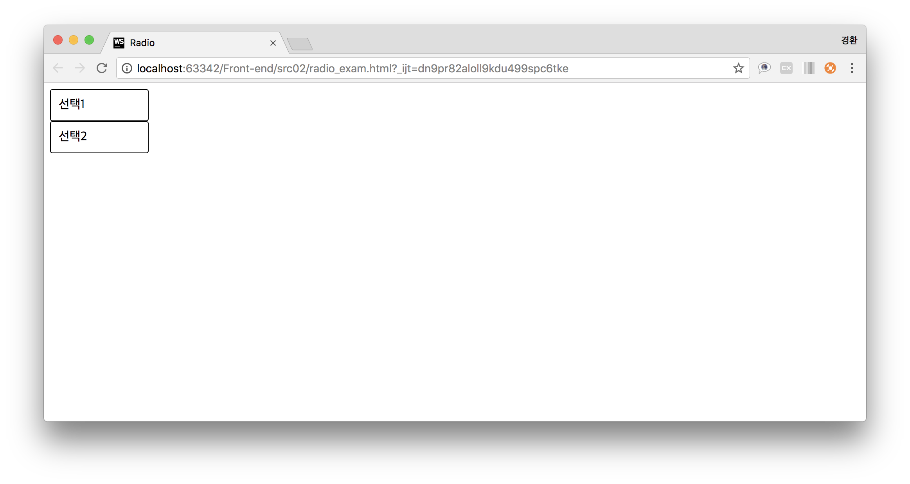

6. 사각형 가로정렬
~~~
display: inline-block;
~~~
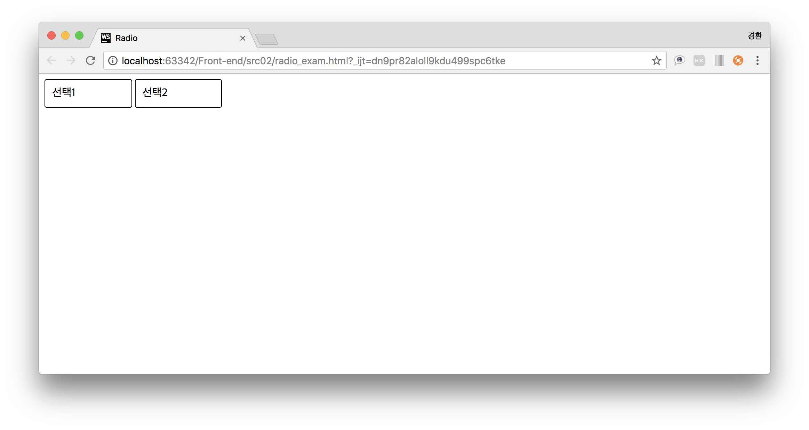
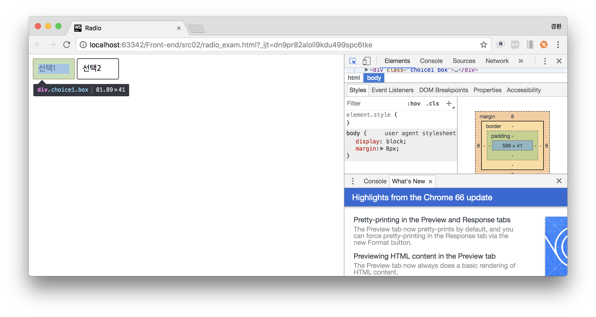
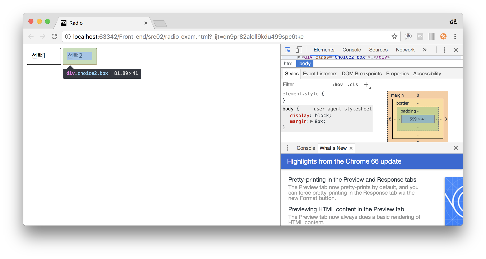

7. 전체 중앙정렬
~~~

    <label>
        <input type="radio" name="exam">
        

            선택1
        

    </label>

    <label>
        <input type="radio" name="exam">
        

            선택2
        

    </label>

~~~
~~~
.middle{
    text-align: center;
}
~~~
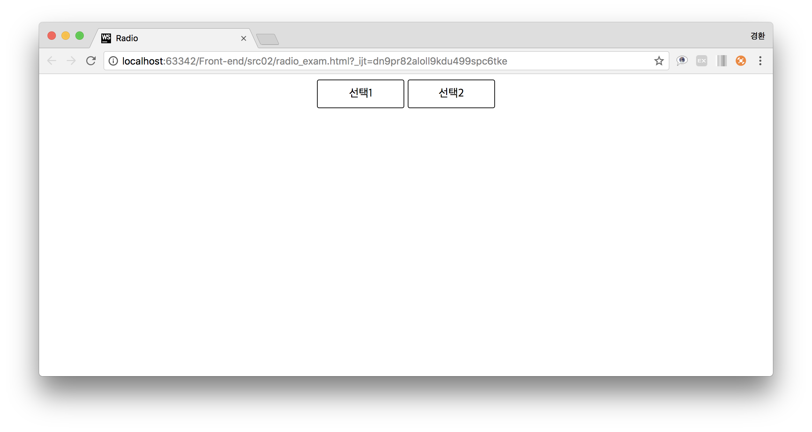

8. 버튼 선택 시 배경 색 변경
~~~
input[type="radio"]:checked + .box{
    background-color: aquamarine;
}
~~~
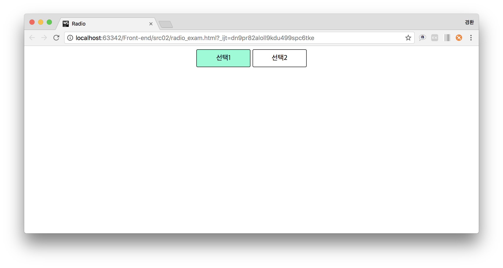
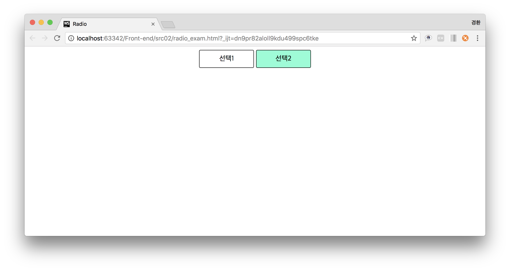
