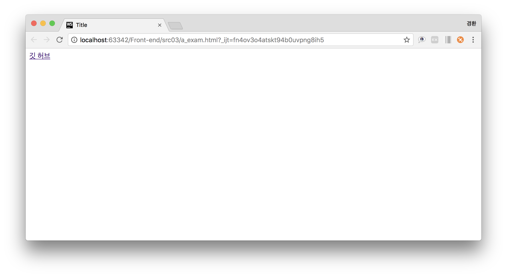
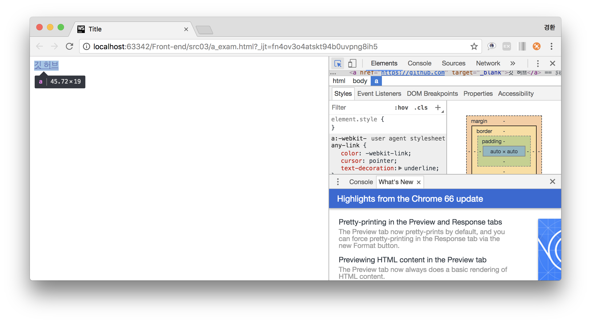
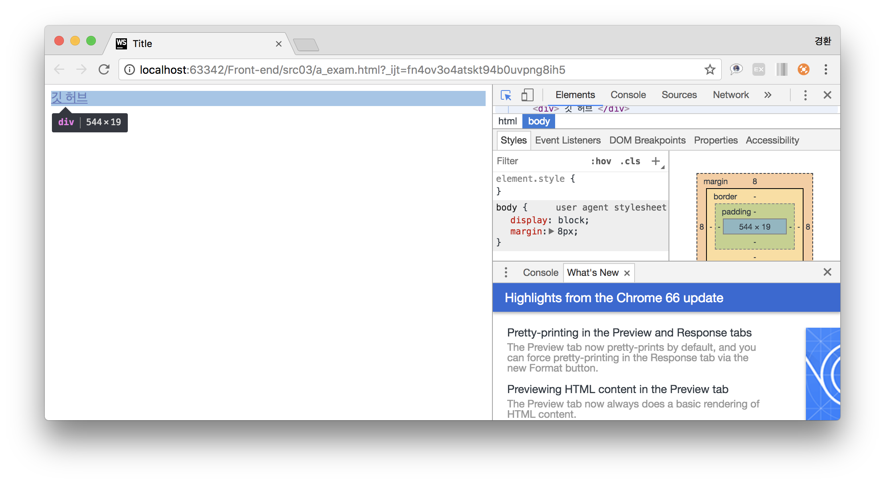
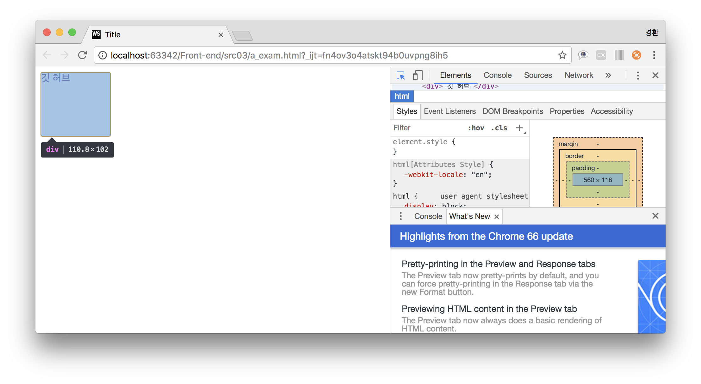
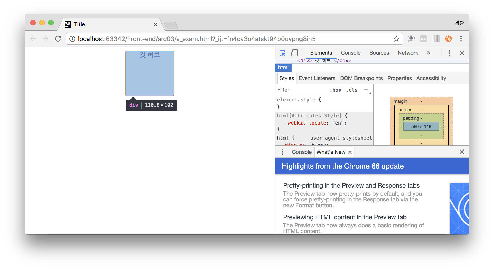

## Extend "a tag" area ##
a 태그 영역 넓히기

### Resolution
1. a 태그 생성
~~~
<a href="https://github.com" target="_blank">깃 허브</a>
~~~

2. block 태그로 a 태그영역 감싸기
~~~
<a href="https://github.com" target="_blank">
    
 깃 허브 

</a>
~~~

3. 꾸미기 및 영역 크기조정
~~~
div {
    border: 1px solid black;
    border-radius: 3px;
    width: 20%;
    height: 100px;
    display: inline-block;
}
~~~

4. 중앙정렬
~~~
body{
    text-align: center;
}
~~~

