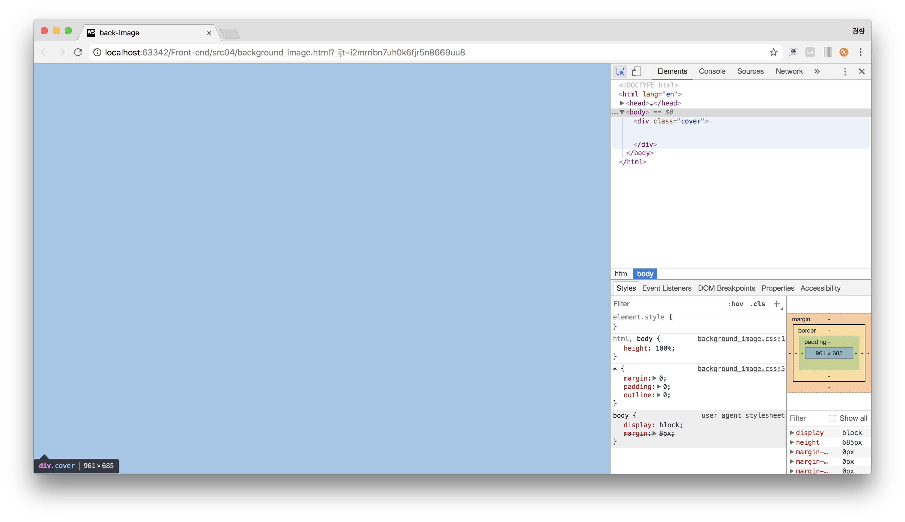

## Insert & Resize background_image ##
배경 이미지 삽입 및 크기 조정

### Resolution
1. 배경을 지정할 block 태그 생성
~~~

~~~

2. html, body 세로 늘리기
~~~
html, body{
    height: 100%;
}
~~~

3. 전체 테두리, 여백제거
~~~
*{
    margin: 0;
    padding: 0;
    outline: 0;
}
~~~

4. 배경삽입 영역 세로 늘리기
~~~
.cover{
  height: 100%;
}
~~~

5. 배경 이미지 삽입
~~~
background-image: url('./img/cover_image.jpg');
~~~

6. 배경 이미지 비율조정
~~~
background-size: cover;
~~~~

7. 배경 이미지 위치 중앙정렬
~~~
background-position: center;
~~~

